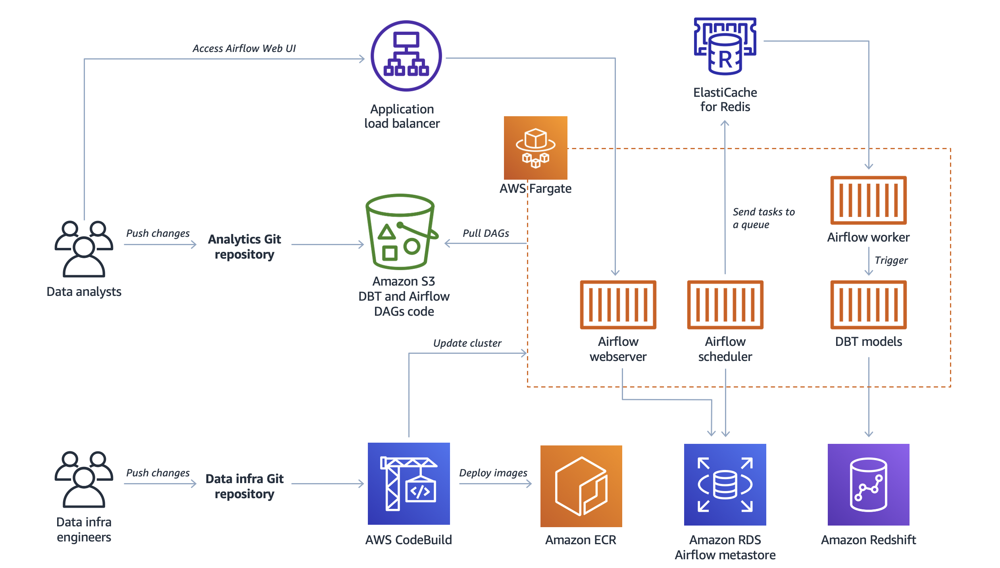

# DataOps Platform with Apache Airflow and dbt on AWS

This repository contains the code to deploy the architecture described in the blog post Build DataOps platform to break silos between engineers and analysts:

*"Companies strive to make data driven decisions related to their customers, marketing, and finance in order to improve their product or business and provide the best service. Data teams are the key enabler in this process, and usually consist of multiple roles such as data engineers and analysts. In this blog post we will discuss and build a data platform that foster effective collaboration between engineers and analysts. We will show you how to enable data analysts to transform data in Redshift by using software engineering practices – [DataOps](https://en.wikipedia.org/wiki/DataOps). We will demonstrate how analytics transformations, defined as DBT models, can be submitted as a part of CI/CD pipeline, and then scheduled and orchestrated by Apache Airflow."*

---

## Architecture overview

The architecture involves the following AWS services:
* **Amazon Elastic Container Service**, to run *Apache Airflow*'s webserver, scheduler and workers as well as *dbt* models as AWS Fargate tasks
* **Amazon Elastic Container Repository**, to store Docker images for *Airflow* and *dbt*
* **Amazon Redshift**, as data warehouse to host the data
* **Amazon Relational Database System**, as [metadata store](https://airflow.apache.org/docs/stable/howto/initialize-database.html) for *Airflow*
* **Amazon ElastiCache for Redis**, as a [Celery backend](https://airflow.apache.org/docs/1.10.1/howto/executor/use-celery.html) for *Airflow*
* **AWS CodeBuild**, to automate the deployment of the latest version of the *Airflow* and *dbt* Docker Images to Amazon ECR
* **Amazon Simple Storage Service**, to store artifacts for *Airflow* DAGs and *dbt* models

## Repository structure

In this repository there are two main project folders: [`dataops-infra`](dataops-infra) and [`analytics`](analytics). This setup is meant to demonstrate how DataOps can foster effective collaboration between data engineers and data analysts, separating the platform infrastructure code from the business logic jobs running on it. 

The two projects should be considered as two separate repositories following their own release cycles.

### DataOps Platform Infrastructure

The `dataops-infra` folder contains code and intructions to deploy the platform infrastructure described in the [**Architecture overview**](#architecture-overview) section. This project is created from the prospective of a data engineering team that is responsible for creating and maintaining the data infrastructure such as data lakes, data warehouses, and CI/CD pipelines for analytics.

### Analytics 

The `analytics` folder contains code and instructions to manage and deploy *Airflow* and *dbt* DAGs on the DataOps platform. This project is created from the prospective of a data analytics team of data analysts and data scientists. They have domain knowledge and are responsible for serving analytics requests from different stakeholders such as marketing and business development teams so that a company can make data driven decisions.

## License

[MIT](/LICENSE)
